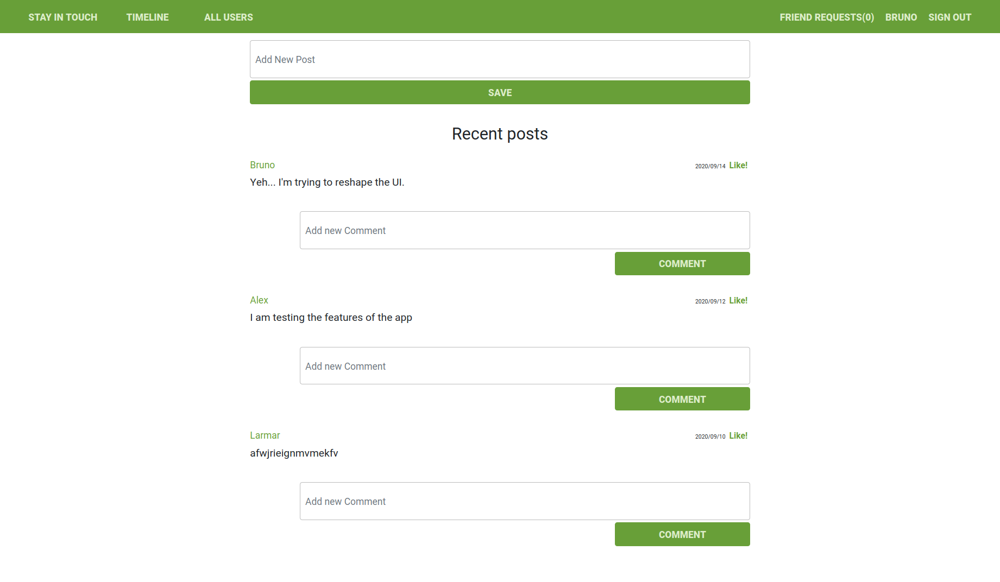

# Scaffold for social media app with Ruby on Rails

> This repo includes intial code for social media app with basic styling. Its purpose is to be a starting point for Microverse students.



## Built With

- Ruby v2.7.0
- Ruby on Rails v5.2.4

## Live Demo

[Live Demo Link](https://jelil-ror-social-scaffold.herokuapp.com/)

## Getting Started

To get a local copy up and running follow these simple example steps.

### Prerequisites

- Ruby: 2.6.3
- Rails: 5.2.3
- Postgres: >=9.5
- Heroku CL

### Setup

Instal gems with:

```bash
bundle install
```

Setup database with:

```bash
   rails db:create
   rails db:migrate
```

### Usage

Start server with:

```bash
    rails server
```

Open `http://localhost:3000/` in your browser.

### Run tests

```bash
    rpsec --format documentation
```

> Tests will be added by Microverse students. There are no tests for initial features in order to make sure that students write all tests from scratch.

### Deployment

Deploy your of the app to Heroku using the following steps in your terminal.

- Navigate to the project's directory and make changes to your codes.
- Commit your works
- Run

```bash
    heroku create <your-app-name(optional)>
```

```bash
    git push heroku master
```

#### NOTE

In case you want deploy to Heroku from a defferent branch aprt from the master branch,
all you to do is to skip the second step and run this;

```bash
    git push heroku <branch-name>:master
```

## Authors

👤 Jelil Faisal Abudu

- Github: [JelilFaisalAbudu](https://github.com/JelilFaisalAbudu)
- Twitter: [@jelilabudu](https://twitter.com/jelilabudu)
- Linkedin: [jelilfaisalabudu](www.linkedin.com/in/jelilfaisalabudu)

## 🤝 Contributing

Contributions, issues and feature requests are welcome!

Feel free to check the [issues page](issues/).

## Show your support

Give a ⭐️ if you like this project!

## Acknowledgments

- RailsSpace
- My Stand-up Team Memmbers
